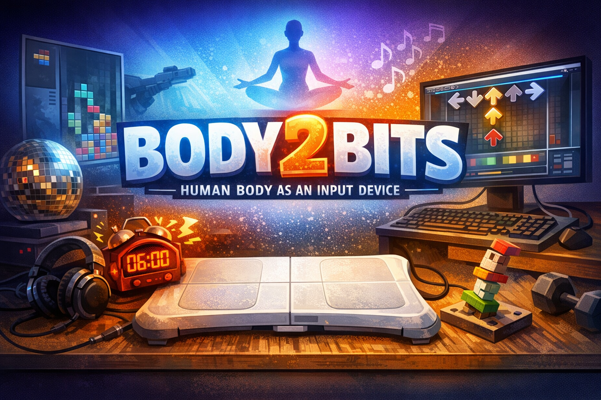

# Body2Bits

  

  
  
  
  
  

  <strong>Human body as a game controller.</strong> 
  Linux, weird hardware, classic games.

---

Body2Bits is an experimental project that explores using the human body  
as a game controller on Linux.  
Unconventional input devices, physical movement, and classic games.

## Status

🧪 **Experimental / Work in Progress**  
Initial prototype created on **2026-01-19**.

## Current Prototype

- Wii Balance Board as input device
- Linux (evdev / uinput)
- Physical movement mapped to keyboard input
- Persistent calibration support
